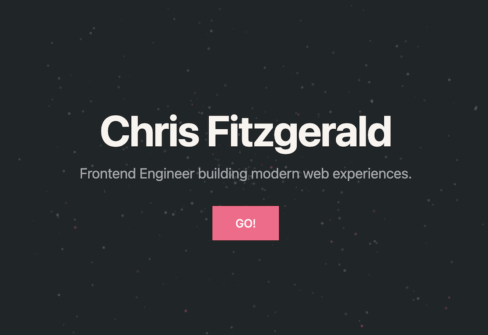

# Chris Fitzgerald



## Check it out here: 

https://chrisfitzgerald.dev/

A personal portfolio built with Next.js.

The goal was to create something subtle and well-structured — clean spacing, effective motion, and thoughtful interaction.  


---

## Stack

- Next.js 15
- React 19
- TypeScript
- Tailwind CSS
- Deployed on Vercel

---

## Notes

This project uses the App Router architecture and focuses on:

- Lightweight structure
- Clean component separation
- Responsive layout
- Subtle motion and scroll behavior
- Maintainable, readable code

It’s designed to feel natural rather than animated for the sake of animation.

---

## Running Locally

Clone the repository:

```bash
git clone https://github.com/Chrisfitzz/MyWebPortfolio.git
cd MyWebPortfolio
```

Install dependencies:

```bash
npm install
```

Start the development server:

```bash
npm run dev
```

Then open:

```
http://localhost:3000
```

---

## Production Build

```bash
npm run build
npm start
```

---

## Deployment

The project is deployed on Vercel.

---

## Contact

GitHub: https://github.com/Chrisfitzz  
LinkedIn: https://www.linkedin.com/in/chrisfitzzz/


